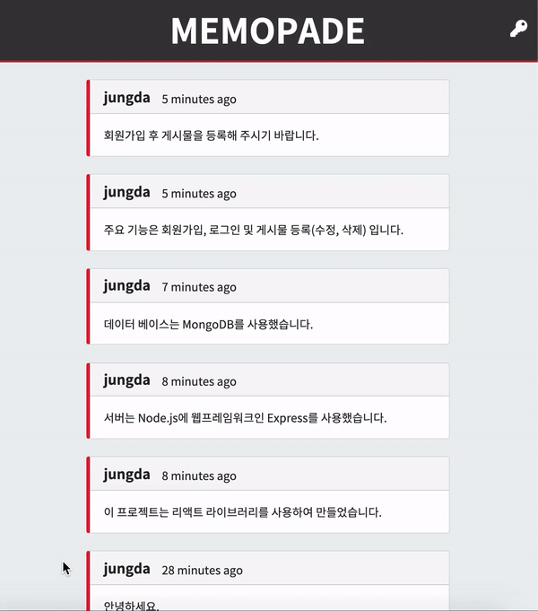

# 프로젝트 제목
리액트 포트폴리오

# 프로젝트 내용
* 프론트 라이브러리: React
* 서버: Node.js
* 데이터베이스: MongoDB

위 내용을 사용하여 회원가입을 포함한 게시물 작성 프로젝트 만들기

## 프로젝트 화면

# 프로그램 주요 스택

## 클라이언트

* Bootstap
* React
* React-router
* Redux
* React-addons-update: Immutability Helper
* Axios

## 서버

* Express: Node.js 웹 프레임워크

## 데이터베이스

* Mongoose: MongoDB 데이터 모델링 툴
